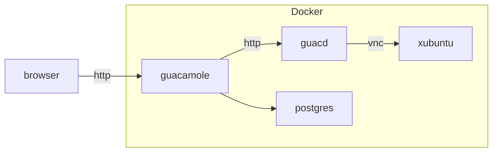
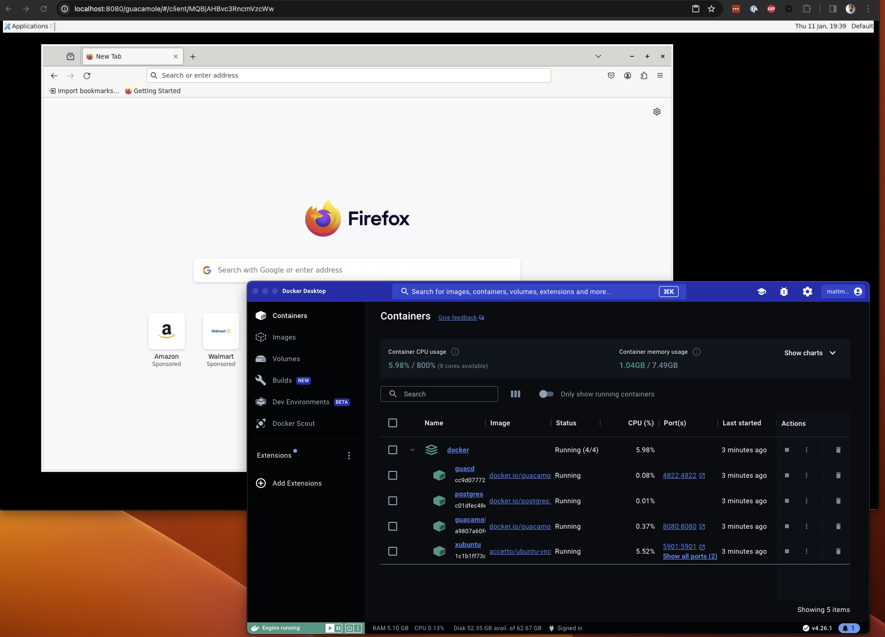

# Overview
This repo contains a basic docker-compose solution to run a linux desktop environment behind a guacamole server without 
needing to use a full virtual machine. A minimal xubuntu is used as the desktop environment to reduce memory usage and 
improve rendering speed over VNC.



For production use we would need to:
- port to EKS
- add a reverse proxy in front of guacamole
- set a static memory allocation for the xubuntu container to prevent node exhaustion
- package any other tools beyond just Firefox into the xubuntu image
- determine an approach for persistent storage of `/home` on the xubuntu container (e.g. NFS/EFS)

# Setup
We already assume the following exists:
- A docker host with docker-compose installed
- Dockerhub credentials

## Database Setup
One-time database setup:
```shell
echo "Preparing folder init and creating ./init/initdb.sql"
mkdir ./init >/dev/null 2>&1
mkdir -p ./nginx/ssl >/dev/null 2>&1
chmod -R +x ./init
docker run --rm guacamole/guacamole /opt/guacamole/bin/initdb.sh --postgresql > .docker/./init/initdb.sql
```

## Guacamole VNC Connection Setup
On first run, you will need to create a new user and connection. The connection should be configured as follows:

| Attribute   | Value     |
|-------------|-----------|
| Protocol    | `VNC`     |
| Hostname    | `xubuntu` |
| Port        | `5901`    |
| Username    | `xubuntu` |
| Password    | `xubuntu` |
| Color depth | `24`      |
| Width       | `1920`    |
| Height      | `1080`    |

# Usage

Start the entire stack using `docker compose -f .docker/docker-compose.yml up -d` and wait for the containers to start.

Guacamole is exposed at `http://localhost:8080/guacamole` and the default credentials are `guacadmin` and `guacadmin`.

